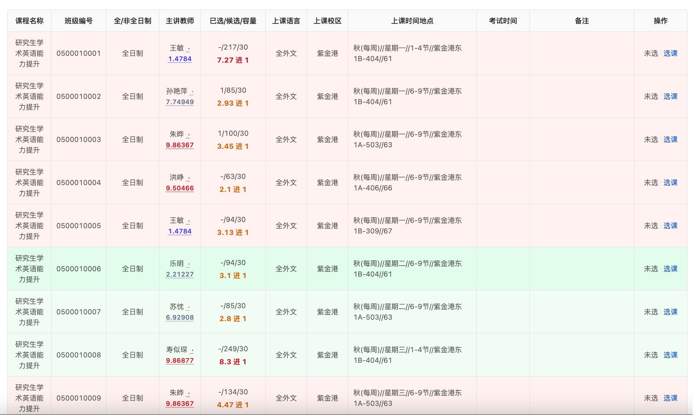
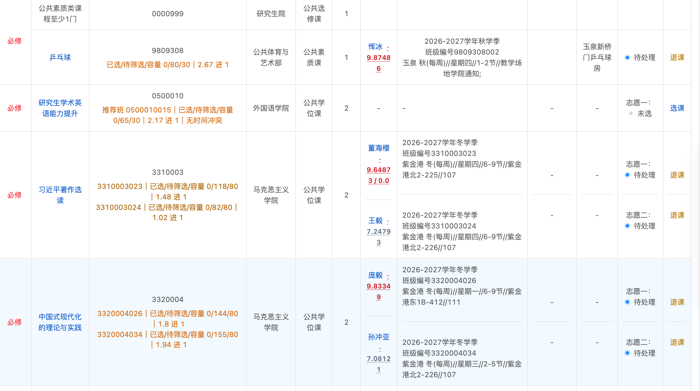

# 浙大研究生选课助手

[](LICENSE)

一个适用于 `https://yjsy.zju.edu.cn/` 的 Chrome/Edge Manifest V3 扩展。它在研究生选课页面补充实时人数、筛选比、时间冲突和校区提醒，帮助查看信息；不会替你自动选课或退课。

> 本项目是独立的非官方开源项目，与浙江大学、浙江大学研究生院及选课系统运营方没有隶属、合作或认可关系。使用前请阅读[免责声明](DISCLAIMER.md)。

## 功能

- 通过选课系统自身的实时查询接口刷新人数；选课总表中，已选课程直接显示当前教学班的“已选/待筛选/容量”。
- 未选课程如果存在时间不冲突且更容易进入的教学班，推荐信息直接显示在该课程行内，不占用侧边窗口。
- 同时显示 `待筛选 ÷（容量－已选）` 的结果，例如 `2 进 1`；它是当前竞争程度的估算，不是录取概率。
- 一门课只有一个已选志愿时，只显示人数和 `x 进 1`，不显示“当前班”或教学班号；同一课程有多个已选志愿时才显示各自的教学班号并分行展示。打开班级选择窗口后，每个班的人数下方也会显示 `x 进 1`。
- 筛选比文字按难度着色，不添加底色或左侧色线：低于 0.3 为蓝色低报课提醒，0.3–1 为绿色，1–1.5 为黄色，1.5–5 为橙色，5–10 为红色，10 以上为深红色。
- 打开“课程班级选择”窗口时自动着色：红色为与其他已选课程冲突，绿色为不冲突，黄色为仅与同一课程的已选教学班冲突，蓝色为当前已选教学班。
- 已选课程如果还有其他教学班，会在课程编号旁显示“查看其他班”；弹窗中可对比所有教学班的容量、筛选比、时间和冲突状态，方便决定是否换班。该弹窗只读，不会自动提交选退课。
- 识别秋/冬/秋冬、春/夏/春夏，以及每周、单周、双周和节次范围。
- 数据只保存在浏览器本地，不上传账号或课程信息。
- 实验性功能：从 [查老师](https://chalaoshi.netlify.app/) 公开教师数据中读取评分，在教师姓名旁显示评分；点击评分会在新标签页打开对应教师详情；数据缓存 7 天。
- 实验性功能：可在侧边栏多选常住校区；已选课程校区不在所选范围内时显示提醒。

## 安装

1. 打开 Chrome 的 `chrome://extensions/`（Edge 为 `edge://extensions/`）。
2. 开启右上角“开发者模式”。
3. 点击“加载已解压的扩展程序”。
4. 选择本文件夹 `zju-course-helper`。
5. 刷新研究生选课页面。右下角出现“选课助手”即安装成功。

## 界面示意

以下截图来自真实选课页面，仅用于展示扩展的信息布局和颜色提示。截图中的课程、人数、教师评分与校区信息会随页面和时间变化，不能作为当前选课结果或录取概率的保证。





## 隐私与权限

- 扩展只请求 `yjsy.zju.edu.cn` 的课程查询接口，以及 `chalaoshi.netlify.app` 的公开教师评分页。
- 课程快照、刷新冷却时间和常住校区偏好仅保存在浏览器本地；扩展不上传账号、Cookie、课表或选课数据。
- 扩展复用当前已登录页面的同源请求能力，但不读取或保存登录凭据。
- 教师评分是可选的实验性功能，数据来自公开第三方网站；该网站不可用或数据变化时，评分功能可能不可用。

## 使用

安装后请刷新一次“查看我的课程”页面。扩展会观察这次由站点自身发出的课程查询，并在等待一分钟后主动查询全部课程；也可以点击右下角“刷新实时人数”。自动刷新和手动刷新共用一分钟冷却，冷却期间按钮会显示剩余时间并禁用。当前班级和推荐班级会显示在对应课程编号下方。右下角只保留刷新状态和颜色图例。打开任意未选课程的班级列表后，教学班仍会自动着色。

点击教师评分标记会在新标签页打开查老师并自动展开对应详情；侧边栏可用右上角按钮收起为底部小栏。

人数格式固定为“已选/待筛选/容量”。蓝色低报课只表示人数较少、存在停开可能，并不代表学校一定会停开。批量刷新期间如果你打开了班级窗口，扩展会暂停后台刷新，避免干扰页面自身的班级查询。

推荐会排除与当前已选课程冲突的班级，并优先选择筛选比更低、剩余容量更多的教学班。筛选比是基于当前快照的估算，人数变化后也会改变；没有剩余名额时不会推荐。

## 技术说明

站点当前版本的班级查询接口为 `/py/pyKcbj/selectXsKxbjByKckId`，响应中的 `xzrs`、`hxrs`、`bjrl` 分别对应已选、待筛选、容量。扩展在内存中复用页面自己的同源请求头，不读取 Cookie，也不保存登录凭据。

## 开发与验证

本项目没有构建步骤。加载本目录即可调试；提交前可运行：

```bash
node regression.test.mjs
node --check content.js
node --check page-bridge.js
node --check background.js
node --check teacher-detail.js
```

测试夹具位于 `tests/`，用于验证课程编号、筛选比、冲突标记和教师评分链接的核心行为。

## 免责声明

人数、筛选比、课程状态、冲突识别、校区识别和教师评分都只能作为辅助参考。它们可能因页面结构、接口、缓存、网络、数据源或学校规则变化而不准确、过时或不可用；选课资格、筛选结果、课程开停及任何后果均以学校系统和相关规定为准。详见[免责声明](DISCLAIMER.md)。

请不要将本扩展用于高频请求、绕过系统限制、批量自动化选退课或其他违反学校规定、网站条款或法律法规的用途。

## 许可证

本项目以 [MIT License](LICENSE) 开源。MIT 许可证允许使用、修改和再发布，但不提供任何保证；使用者仍需自行承担使用风险。
